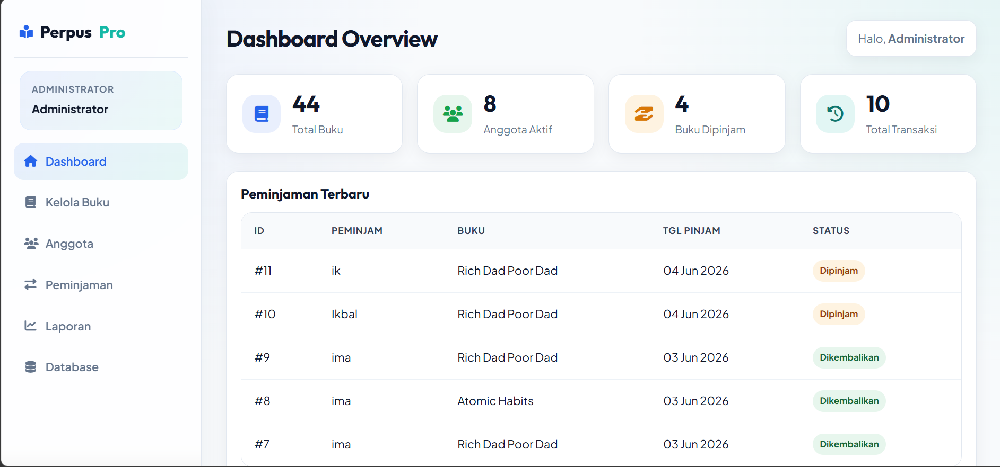

# 📚 PustakaOne (Proyek UAP)
PustakaOne merupakan sistem informasi perpustakaan berbasis web yang dibangun menggunakan PHP dan MySQL. Sistem ini digunakan untuk mengelola data buku, anggota, peminjaman, pengembalian, dan laporan perpustakaan. Pada proyek ini juga diimplementasikan beberapa materi basis data seperti stored procedure, trigger, fragmentasi database, backup database, dan task scheduler.


## 👣 Stored Procedure


Stored Procedure digunakan sebagai alur eksekusi utama untuk proses-proses penting pada sistem perpustakaan. Procedure disimpan langsung di database sehingga dapat meningkatkan konsistensi, keamanan, dan efisiensi pengolahan data.

### user/borrow.php

**tambah_peminjaman(uid)** : Procedure ini digunakan untuk membuat transaksi peminjaman baru ketika user melakukan peminjaman buku.

Procedure akan:
- Menambahkan data ke tabel `peminjaman`
- Menetapkan status awal sebagai `borrowed`
- Mengembalikan `id_peminjaman` yang baru dibuat

```php
$result = $conn->query("CALL tambah_peminjaman($user_id)");
$row = $result->fetch_assoc();
$id_peminjaman = $row['id'];
$conn->next_result();
```

---

### admin/transactions.php

**kembalikan_buku(id_peminjaman)** : Procedure ini digunakan untuk memproses pengembalian buku dengan mengubah status peminjaman menjadi `returned`.

Procedure akan:
- Mengubah status peminjaman menjadi `returned`
- Mengisi tanggal pengembalian buku
- Menjadi pemicu trigger `trg_tambah_stok`

```php
$conn->query("CALL kembalikan_buku($id_peminjaman)");
```

---

### admin/members.php

**lihat_members()** : Procedure ini digunakan untuk menampilkan seluruh data anggota perpustakaan yang terdaftar pada sistem.

```php
$result = $conn->query("CALL lihat_members()");
```

---

### admin/books.php

**hapus_buku(id_buku)** : Procedure ini digunakan untuk menghapus data buku berdasarkan ID buku yang dipilih admin.

```php
$conn->query("CALL hapus_buku($id_buku)");
```

## ⚡ Trigger


### user/borrow.php

**trg_kurangi_stok** : Trigger ini bertujuan untuk menjaga konsistensi stok buku saat proses peminjaman.

Ketika data baru ditambahkan ke tabel `detail_pinjam`, trigger akan otomatis mengurangi stok buku yang dipinjam.

```php
$stmt_detail = $conn->prepare("
    INSERT INTO detail_pinjam (id_peminjaman, id_buku)
    VALUES (?, ?)
");
$stmt_detail->execute();
```

---

### admin/transactions.php

**trg_tambah_stok** : Trigger ini bertujuan untuk menjaga konsistensi stok buku setelah proses pengembalian.

Ketika status peminjaman berubah menjadi `returned`, trigger akan otomatis menambah kembali stok buku yang sebelumnya dipinjam.

```php
$conn->query("CALL kembalikan_buku($id_peminjaman)");
```


## 🗃️ Backup Database
Untuk menjaga keamanan dan ketersediaan data, sistem dilengkapi fitur backup database menggunakan `mysqldump`.

Backup disimpan pada direktori:
`storage/backups/` sehingga data tetap aman meskipun admin tidak sedang login ke sistem, selain itu akan ditampilkan pada `backup_list.php`
Nama file backup menggunakan _timestamp_ sehingga mudah dilacak. Selain itu keseluruhan backup hanya dapat dilakukan oleh **admin**.

## Backup Manual
Backup dilakukan melalui file `backup.php` dengan menu:


## Backup Otomatis 
Menyediakan dua backup otomatis:
#### 1. Backup otomatis menggunakan Windows Task Scheduler 
Dengan mengeksekusi script: `auto_backup.php` yang dapat dijalankan menggunakan Windows Task Scheduler setiap 1 hari sekali tanpa perlu membuka aplikasi.
#### 2. Backup Otomatis Saat Admin Login
Ketika admin berhasil login, sistem akan memeriksa waktu backup terakhir. Jika sudah lebih dari 24 jam sejak backup terakhir dibuat, maka sistem akan secara otomatis membuat backup database baru.
